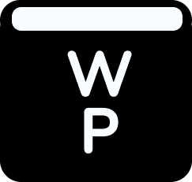
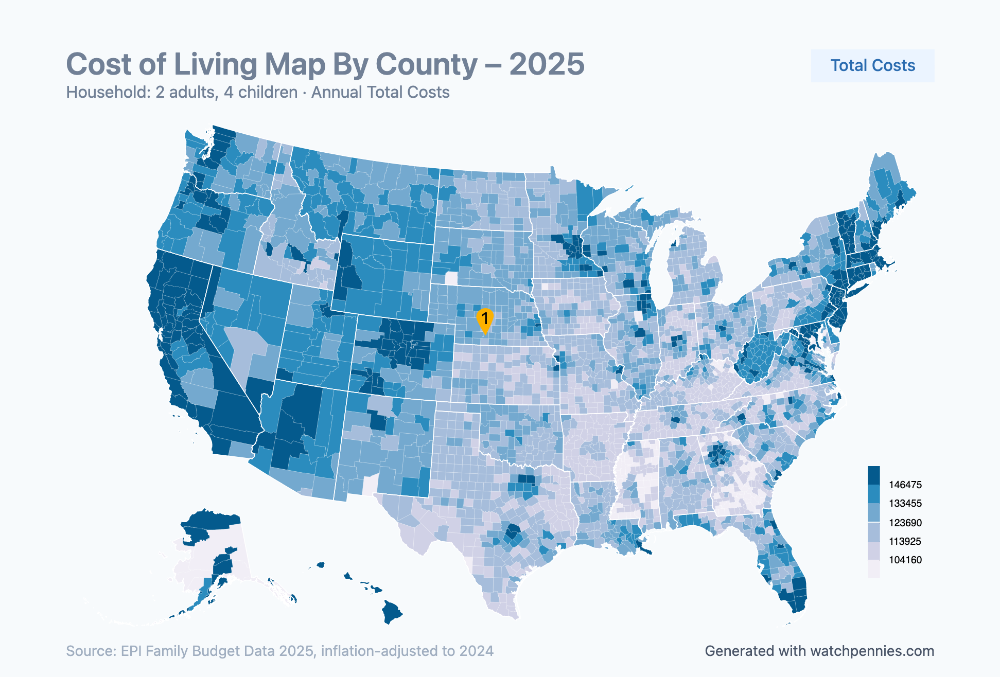

<h1 align="center"> WatchPennies </h1>  

  Free-to-Use Cost of Living Breakdown

[watchpennies.com](https://watchpennies.com/)

### Interactive Web Map

<!-- ## Features

A few of the things you can do with GitPoint:

* View user activity feed
* Communicate on your issue and pull request conversations
* Close or lock issues
* Apply labels and assignees
* Review and merge pull requests
* Create new issues
* Star, watch and fork repositories
* Control your unread and participating notifications
* Easily search for any user or repository

  

  

 -->

## Feedback

Feel free to send us feedback on [email](infowatchpennies@gmail.com) or [file an issue](https://github.com/lunava/WatchPennies/issues). Feature requests are always welcome. 

If there's anything you'd like to chat about, email is always welcome!
<!-- ## Contributors

This project follows the [all-contributors](https://github.com/kentcdodds/all-contributors) specification  -->

